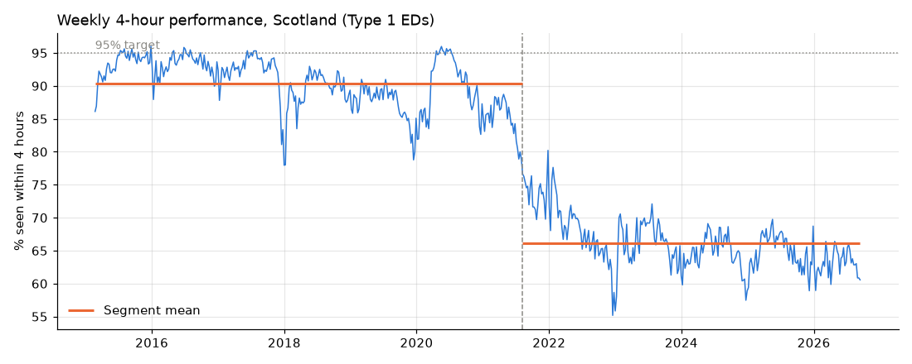
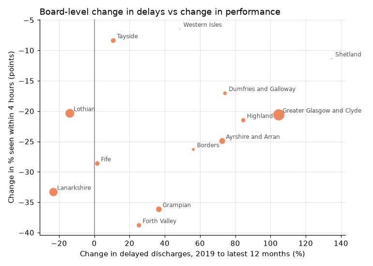

# Scotland A&E Waiting Times

An end-to-end analysis of weekly Emergency Department performance in NHS Scotland: a SQL pipeline
built on Public Health Scotland open data, a statistical investigation of what is driving the
decline, a forecast, and an interactive dashboard.

## The question

Between 2015 and 2019 around 90% of patients at Scotland's major Emergency Departments were seen
within 4 hours. Over the last year it was 63%, against a 95% target, and 87,000 patients waited
more than 12 hours. Attendances, meanwhile, are about where they were in 2019. **So what changed?**



## Findings

1. **The fall was a step change in August 2021**, not a gradual drift and not the March 2020
   lockdown. A change-point search puts average performance at 90.4% before and 66.1% after, with
   no recovery since.
2. **Demand does not explain it.** Weekly attendances are back at 2019 levels, and the health
   boards with the most growth in attendances declined the *least* (Spearman ρ = +0.49).
3. **Delayed discharges track the decline nationally but not between boards.** They rose about a
   third alongside the fall, and when they collapsed during the 2020 lockdown A&E briefly hit
   target. But in a fixed-effects model that removes shocks common to all boards, boards whose
   delays rose more did not decline more. NHS Lanarkshire cut delays by 23% and still lost 33
   points.
4. **The largest boards, already closest to their limits in 2019, fell furthest** (ρ = −0.46
   between board size and change). The island boards barely moved.

Together this points to a system-wide shock after 2021 hitting the most stretched boards hardest,
with delayed discharges a symptom of that pressure rather than the main cause. These are
associations in observational data from 14 boards, not causal estimates; see the
[notebook](notebooks/01_drivers.ipynb) for methods and limitations.



## Forecast

A 12-week forecast of national 4-hour performance, trained only on post-break data. Models were
compared with a rolling-origin backtest over two years (27 origins, refitting each time on only
the data available then):

| Model | MAE (pts) |
|---|---|
| Gradient boosting (direct multi-step) | **2.12** |
| ARIMA with Fourier seasonal terms | 2.29 |
| Seasonal naive (same week last year) | 2.36 |
| Naive (last value) | 2.41 |

The best model beats the naive baseline by 12%: weekly performance is noisy and the gains from
modelling are real but modest. Prediction intervals come from the chosen model's own backtest
errors at each horizon.

## How it works

```
data/raw/*.csv                  PHS open data, weekly A&E to 13 Sep 2026
   │  src/pipeline.py           loads into DuckDB, runs sql/ in order
   ▼
sql/01_staging.sql              typed, cleaned hospital-week table
sql/02_marts.sql                national, board, hospital and league-table marts
sql/03_drivers.sql              A&E aligned with delayed discharges and bed occupancy
   │
   ├─ src/analysis.py           break detection, board comparison, fixed-effects models
   ├─ src/forecast.py           backtest and 12-week forecast
   ▼
app/dashboard.py                Streamlit + Plotly dashboard
notebooks/01_drivers.ipynb      full write-up of the driver analysis
```

Some decisions worth noting:

- **Percentages are recomputed from counts**, never averaged, so every patient carries equal weight.
- The source reports each hospital-week under several attendance categories; only `All` is used to
  avoid double counting.
- **Forecasts are trained only on data after the break**, since the earlier regime would pull
  forecasts towards levels not seen since 2021.
- The database is generated, not committed: the dashboard builds it from the raw CSVs on first run.

## Running it locally

```bash
python -m venv .venv
.venv/Scripts/activate            # Windows; source .venv/bin/activate on macOS/Linux
pip install -r requirements-dev.txt
python -m src.pipeline            # build the database and forecast
streamlit run app/dashboard.py
```

## Data

Weekly A&E activity, delayed discharges, acute bed occupancy, and hospital and health board
lookups from [Public Health Scotland open data](https://www.opendata.nhs.scot). Contains public
sector information licensed under the
[Open Government Licence v3.0](https://www.nationalarchives.gov.uk/doc/open-government-licence/version/3/).
